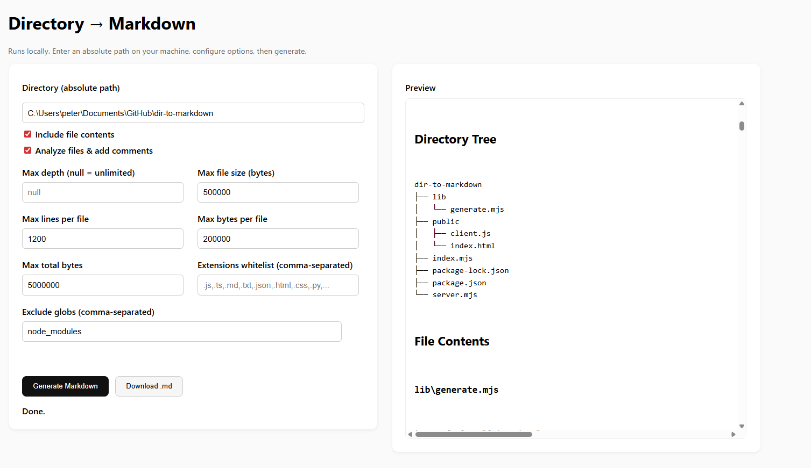

# dir-to-markdown



Generate a single Markdown snapshot of any folder — directory tree plus (optionally) inlined file contents and lightweight per-file analysis. Use it from the CLI or via a minimal local web UI.

Perfect for pasting project context into ChatGPT or other services.

✨ Features

Tree view of all files/folders (like tree, but Markdown-ready).

Inline contents of text/code files (size + depth limits to prevent huge outputs).

Per-file analysis (optional): LOC, imports/exports, TODO/FIXME counts, basic complexity proxy, potential secret flags, and a suggested header comment.

Respects ignores via .mdgenignore and/or your .gitignore.

Two ways to run: CLI (dir2md) or local Web UI (npm start).

🔧 Requirements

Node.js 18+

macOS / Linux / Windows (PowerShell supported)

🚀 Quick start
# 1) Install dependencies
npm install

# 2a) Run the CLI directly
node index.mjs "/absolute/path/to/your/project" --contents --analyze

# 2b) (optional) Link the CLI globally as `dir2md`
npm link
dir2md "/absolute/path/to/your/project" --contents --analyze

# 3) Or start the local web UI
npm start
# open http://localhost:3000


Windows tip (PowerShell): Quote paths with spaces and don’t paste the prompt > by accident.
✅ dir2md "C:\Users\you\Documents\My Project" --contents --analyze

🧭 CLI usage
dir2md <directory> [options]


Examples

# tree only (no contents)
dir2md "/repos/cool-app"

# tree + contents (default trims large files)
dir2md "/repos/cool-app" --contents

# add analysis comments
dir2md "/repos/cool-app" --contents --analyze

# customize output + skip big folders
dir2md . --contents --analyze \
  --output ./snapshot.md \
  --max-depth 6 \
  --exclude "node_modules/**,dist/**,.git/**,**/*.png,**/*.jpg"


Options

Option	Type	Default	Description
-o, --output <file>	string	./snapshot.md	Output Markdown file.
--contents	boolean	false	Inline text/code file contents.
--analyze	boolean	false	Add per-file analysis comments. (If you want analysis without contents, see “Analysis-only mode” below.)
--max-depth <n>	number|null	null	Limit recursion depth (0 = root only).
--max-file-size <bytes>	number	500000	Skip files larger than this many bytes.
--max-lines <n>	number	1200	Trim each file to at most N lines.
--max-bytes <bytes>	number	200000	Trim each file to at most N bytes.
--max-total-bytes <bytes>	number	5000000	Stop inlining once total output exceeds N bytes.
--ext <csv>	string (CSV)	sensible list	Whitelist of extensions to inline (e.g. .js,.ts,.py,.md).
--exclude <csv>	string (CSV)	[]	Ignore globs (supports micromatch/.gitignore-style).

Notes

When --contents is on, per-file Analysis appears above each code block if --analyze is also on.

By default, many common code/text extensions are allowed; binaries are skipped.

🌐 Web UI

Start the UI:

npm start
# then open http://localhost:3000


Enter the directory path (absolute or relative to the server).

Check Include file contents to inline code/text.

Check Analyze files & add comments for per-file analysis.

Click Generate Markdown → preview in the right panel → Download .md.

The web server runs locally and only reads your files from disk. Don’t expose it to the internet.

🧠 Analysis

When Analyze is enabled, each file section includes:

Language + LOC

Functions, Branch points, Complexity≈ (basic cyclomatic proxy)

Imports/exports presence + top import names (first ~50 lines)

TODO/FIXME/HACK/BUG count

Flags for common issues (e.g., console.*, print(), possible secrets, very large files)

Suggested header comment, tailored by language

Analysis-only mode (optional)
If you want analysis even when --contents is off, the generator supports it. Enable “Analyze” and leave “Include file contents” off in the UI, or run:

# if configured in your copy to allow analysis without contents:
dir2md "/repos/cool-app" --analyze


If you used our earlier code exactly, analysis-without-contents is also available (we added a dedicated section called File Analysis when contents are off).

🙈 Ignoring files

You can exclude paths in three ways:

.mdgenignore at the project root

.gitignore at the project root

--exclude "glob1,glob2,..." or the UI field

Examples:

node_modules/**
dist/**
**/*.png
**/*.jpg

🧪 Example output (excerpt)
# Repository Snapshot

- **Root:** `/repos/cool-app`
- **Generated:** 2025-09-11T10:22:18.000Z
- **Options:** { "includeContents": true, "analyze": true, ... }

## Directory Tree

```text
cool-app
├── package.json
├── src
│   ├── api
│   │   └── client.ts
│   └── index.ts
└── README.md

File Contents
src/api/client.ts

Analysis

Language: typescript

LOC: 214

Functions: 6 · Branch points: 9 · Complexity≈ 10

Imports: axios, ./auth, ./types

Imports present: yes · Exports/API: yes

Flags: Uses console.* (consider a logger)

Suggested header:

/**
 * File: src/api/client.ts
 * Purpose: …
 * Key exports: …
 * Notes: …
 */

// (trimmed file content…)


```

## 🩺 Troubleshooting

- **`"…>" is not a directory` on Windows**  
  You probably copied the PowerShell prompt `>` into your command. Use quotes and exclude `>`:  
  `dir2md "C:\Users\you\Documents\My Project" --contents`

- **`dir2md` not found**  
  Use `node index.mjs ...` or run `npm link` once to install the CLI globally.

- **No Analysis in UI**  
  Tick **both** “Include file contents” **and** “Analyze files & add comments”.  
  (If you enabled analysis-only mode in your code, then Analyze alone is enough.)

- **Huge outputs**  
  Increase/adjust `--max-depth`, `--max-lines`, `--max-bytes`, and `--max-total-bytes`, or add ignores.

---

## 🔐 Security / Privacy

- Designed for **local use**: the UI server and CLI read files from your disk.
- The UI sends only **path + options** from the browser to the local Node server.
- Never expose the server publicly; no auth is implemented.

---

## 🧩 Programmatic endpoint (UI server)

`POST /api/generate`

**Body (JSON)**

```json
{
  "directory": "/absolute/path",
  "includeContents": true,
  "analyze": true,
  "maxDepth": 6,
  "maxFileSizeBytes": 500000,
  "maxLinesPerFile": 1200,
  "maxBytesPerFile": 200000,
  "maxTotalBytes": 5000000,
  "extWhitelist": [".js",".ts",".tsx",".jsx",".json",".md",".txt",".html",".css",".py"],
  "excludeGlobs": ["node_modules/**","dist/**",".git/**"]
}

``` 
Response

{ "ok": true, "filename": "snapshot-<folder>.md", "markdown": "..." }

📄 License

MIT

🤝 Contributing

PRs welcome! If you add language heuristics or smarter analysis, keep it fast and dependency-light.
